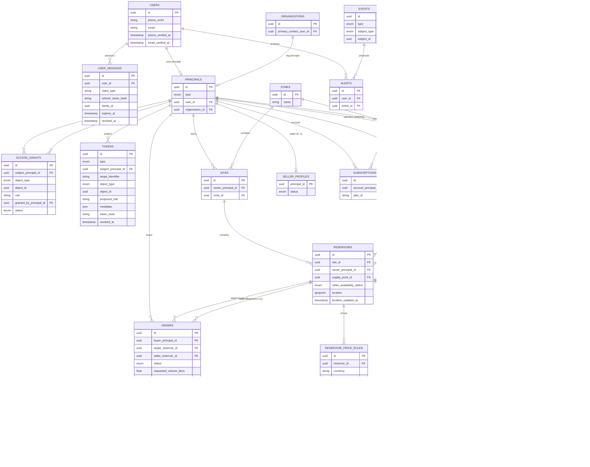

## Jila API Backend — Entity Relationship Diagram (Mermaid)

This ERD is derived from `docs/architecture/jila_api_backend_architecture_v_0 (3).md` (v0.3 hardened).

Anti-drift note:
- This ERD is a **derived visualization** for understanding relationships.
- The **only canonical database schema** (tables/enums/constraints) is:
  - `docs/architecture/jila_api_backend_data_models.md`

### How to read this (brief narrative)

This data model is intentionally built around a few **anti-drift primitives**. When reading the diagram, keep these meanings in mind:

- **`principals`**: a single canonical “actor / owner container” identifier.
  - Every **User** has exactly one **User Principal**.
  - Every **Organization** has exactly one **Org Principal**.
  - Anywhere you see `*_principal_id`, that’s a deliberate “no ambiguity” move: we’re avoiding scattered `user_id` + `organization_id` fields.

- **Ownership vs access (crucial distinction)**:
  - **Ownership** is modeled by `owner_principal_id` on the resource (e.g., a Reservoir is owned by a user-principal or org-principal).
  - **Access** (membership, sharing, delegation) is modeled only via **`access_grants`**.

- **`access_grants`**: the single table for “who can do what on which resource”.
  - `subject_principal_id` = who gets access.
  - (`object_type`, `object_id`) = what they get access *to* (ORG/SITE/RESERVOIR/SUPPLY_POINT/…).
  - `role` = the capability label (interpreted by the permission matrix in the architecture doc).

- **`tokens`**: the single table for short-lived or one-time secrets (OTP, password reset, invite).
  - Invites are represented as a token first; **acceptance materializes an `access_grants` row**.
  - Invite anti-theft binding:
    - If an invite token has `target_identifier` set and the caller is already authenticated, acceptance must bind to a user whose **verified identifier** matches it.
    - For org user onboarding (public invite acceptance), `email` must match `target_identifier` and the user must verify that email before the account becomes `ACTIVE` (see decision D-004).
  - Invite scope can be carried in `tokens.metadata` (for example `site_ids` for org invites).

- **`events`**: the canonical audit/outbox stream.
  - We prefer emitting Events over creating new “history tables” (e.g., SupplyPoint status history).

#### Concrete examples (map to the ERD)

- **Org membership**: a user joins an org when they have an `access_grants` row on `ORG:<org_id>` with role like `MANAGER`.
- **Reservoir sharing**: sender creates a `tokens` row (`INVITE` to `RESERVOIR:<reservoir_id>`); receiver accepts; system creates/updates `access_grants` on that reservoir.
- **Seller listings (v1)**: a principal can expose reservoirs as public listings only when:
  - `seller_profiles.status = ACTIVE`
  - the reservoir has at least one `reservoir_price_rules` row
  - the reservoir has a discoverable location
  - the seller explicitly toggled `reservoirs.seller_availability_status = AVAILABLE`
- **Orders (pricing snapshot)**: at `ORDER_CREATED`, the backend computes a **price snapshot** and stores it on the `orders` row (e.g., `price_quote_total` + `currency`). This snapshot does not change even if price rules change later.
- **Orders (v1 constraint)**: `seller_reservoir_id` is required for v1 instant orders; v1 does not support broadcast “request offers” without explicit seller selection.
- **Device pairing (v1, 1:1)**: attaching a device to a reservoir is explicit; if either side is already paired, the API returns a conflict (detach-first) to prevent silent reassignment.
- **SupplyPoint availability updates**:
  - Community updates are allowed for authenticated users (rate-limited) for `availability_status`.
  - If a SupplyPoint has an operator (`supply_points.operator_principal_id`) or an explicit grant exists, operator updates can carry stronger evidence semantics for availability (e.g., `VERIFIED` vs `REPORTED`).
  - Cached availability conflict resolution is evidence-prioritized (`SENSOR_DERIVED` > `VERIFIED` > `REPORTED`); weaker evidence cannot overwrite stronger cached availability.
  - `operational_status` is a separate field intended for closures/operations, typically set by operator/admin.
- **Telemetry ingestion (v1)**: telemetry for unregistered or unattached devices is discarded (no `reservoir_readings` row); emit a diagnostic event for audit/observability.
- **Reservoir location signals (v1)**: seller/mobile locations are stored as `reservoirs.location` and updated by PATCH (emits `RESERVOIR_LOCATION_UPDATED`).

> Note: `access_grants`, `tokens`, and `events` use **polymorphic references** (`object_type`/`object_id`, `subject_type`/`subject_id`) to avoid table explosion. Those polymorphic links are documented below the diagram.

### Polymorphic reference notes (anti-table-explosion)

- **`access_grants.object_type` + `access_grants.object_id`** points to one of:
  - `ORG` → `organizations.id`
  - `SITE` → `sites.id`
  - `RESERVOIR` → `reservoirs.id`
  - `SUPPLY_POINT` → `supply_points.id`
  - `ORDER` → `orders.id`
  - `DEVICE` → `devices.id`

- **`tokens.object_type` + `tokens.object_id`** is used for invites and points to the same set of objects as above (when `tokens.type = INVITE`).

- **`events.subject_type` + `events.subject_id`** points to:
  - `RESERVOIR` → `reservoirs.id`
  - `DEVICE` → `devices.id`
  - `ORDER` → `orders.id`
  - `SITE` → `sites.id`
  - `ACCOUNT` → `principals.id` (account container)
