## Jila API Backend – API Contract (v1) — Endpoint flow diagrams (Canonical, explanatory)

This file contains **sequence-style endpoint flow diagrams** (Mermaid) that illustrate requests + conditions + outcomes.
It is canonical as supporting documentation, but the **normative** contract is still the endpoint request/response/error shapes in the domain files.

Start from the index: `../jila_api_backend_api_contract_v1.md`.

### 0.5 Endpoint flow diagrams (requests + conditions)

These are **sequence-style endpoint flow diagrams** (UML-style) that show the request, the important decision points, and the resulting HTTP response.

#### 0.5.1 `POST /v1/auth/register` (single org flow)

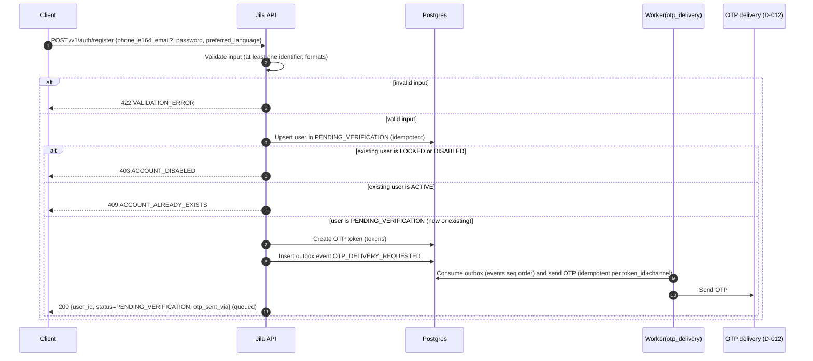

#### 0.5.2 `POST /v1/auth/verify-identifier`

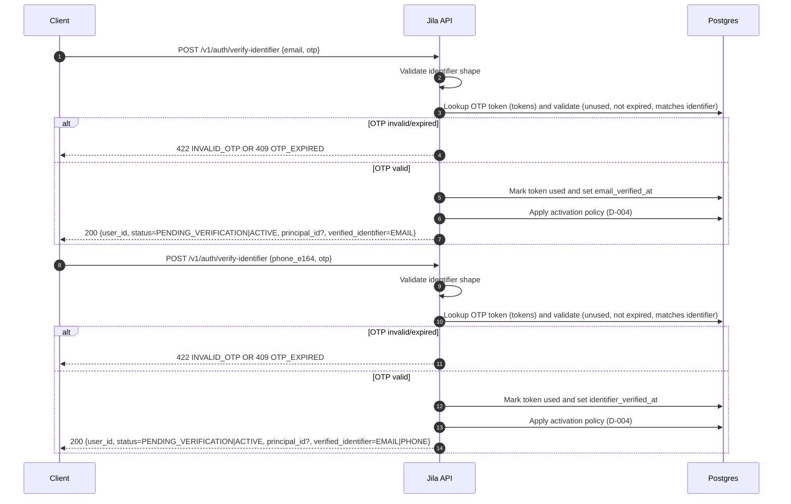

#### 0.5.3 `POST /v1/auth/login`

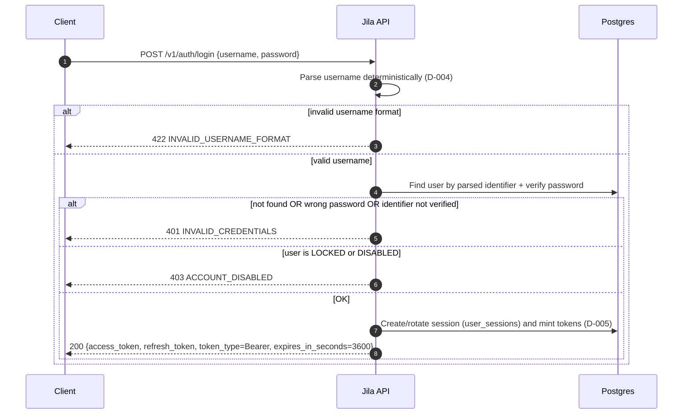

#### 0.5.4 `POST /v1/auth/refresh` + `POST /v1/auth/logout`

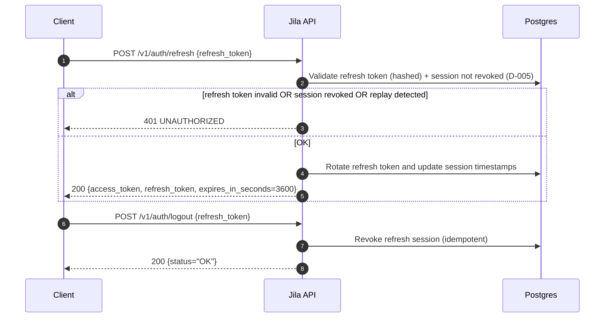

#### 0.5.5 `POST /v1/auth/request-password-reset` + `POST /v1/auth/reset-password`

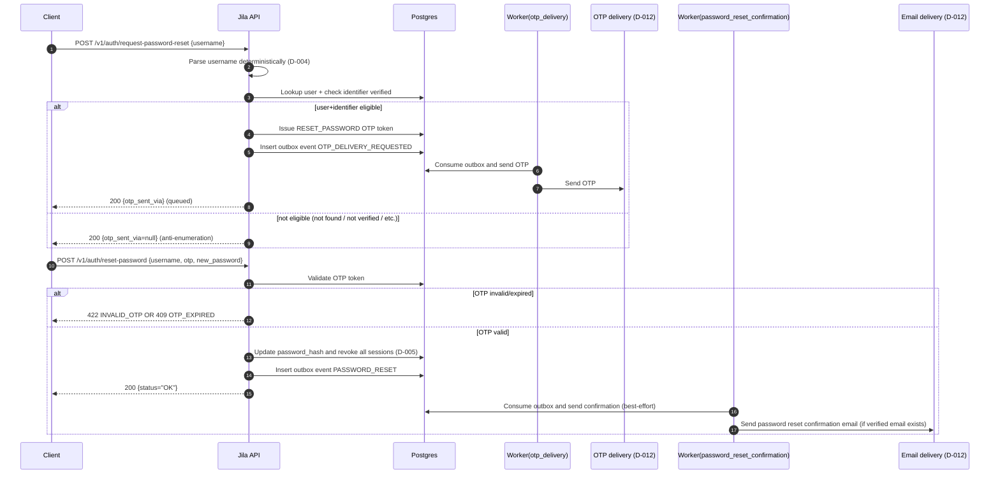

#### 0.5.6 `POST /v1/org-invites/accept` (org onboarding)

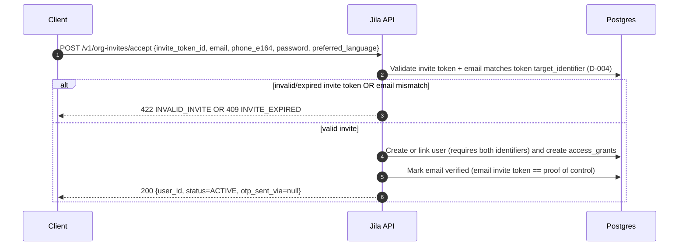

#### 0.5.6a `POST /v1/org-invites/resolve` (org invite prefill; public)

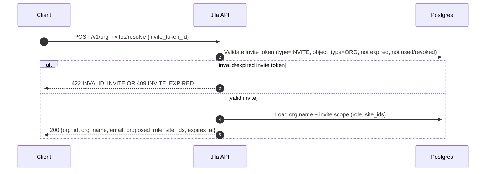

#### 0.5.6a `POST /v1/org-invites/resolve` (org invite prefill; public)


#### 0.5.7a Account-first org selection (canonical)

Clients select an org account explicitly (from `GET /v1/me`) and then call account-scoped endpoints under
`/v1/accounts/{account_id}/...`:

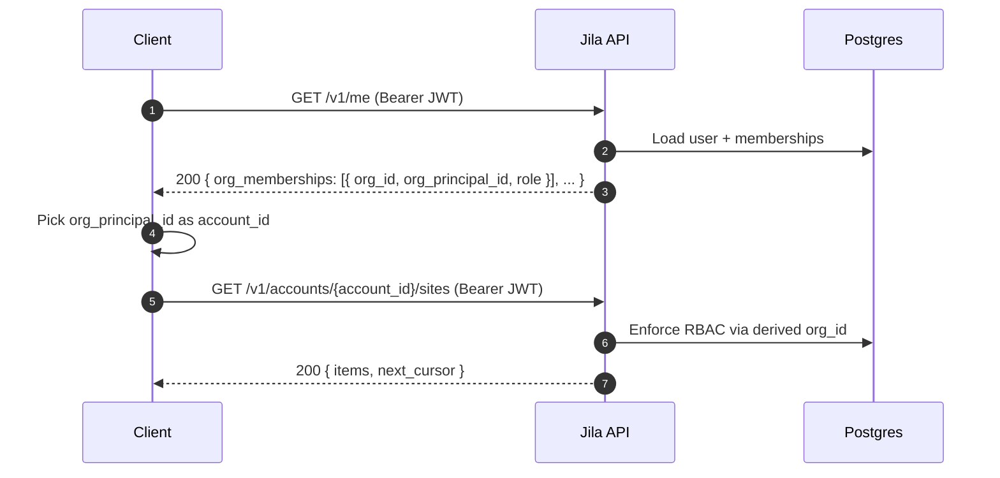

#### 0.5.7 `POST /v1/auth/firebase/custom-token` (token exchange for Firestore)

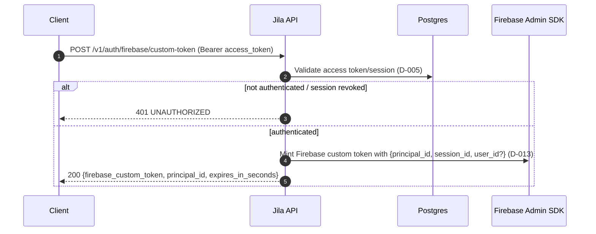

#### 0.5.8 `PATCH /v1/supply-points/{supply_point_id}`

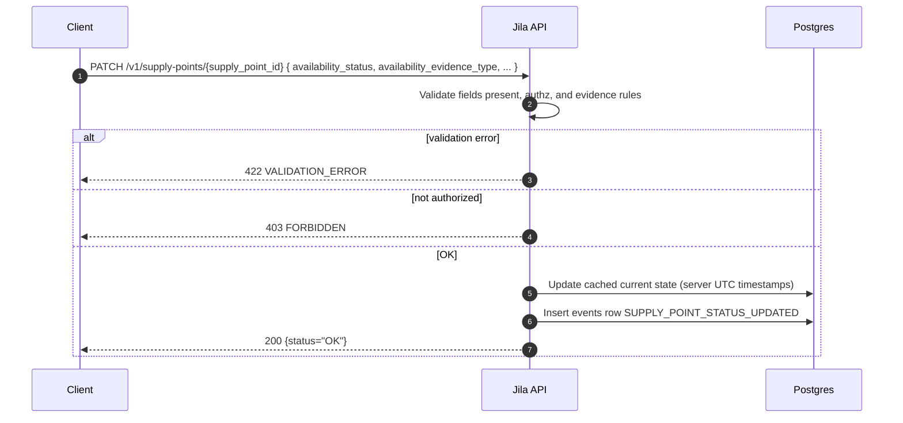

#### 0.5.11 `GET /v1/me`

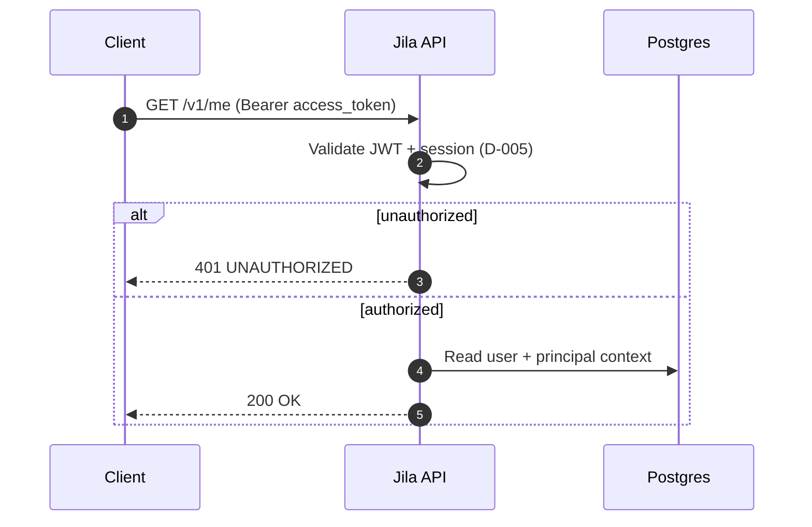

#### 0.5.12 `GET /v1/accounts/{account_id}/reservoirs`

```mermaid
sequenceDiagram
  autonumber
  participant C as Client
  participant API as Jila API
  participant DB as Postgres

  C->>API: GET /v1/accounts/{account_id}/reservoirs (Bearer access_token)
  API->>API: Validate JWT + enforce account scope (USER=caller; ORG=org RBAC)
  alt unauthorized
    API-->>C: 401 UNAUTHORIZED
  else authorized
    API->>DB: Query reservoirs visible via access_grants
    API-->>C: 200 OK
  end
```

#### 0.5.13 `GET /v1/accounts/{account_id}/orders`

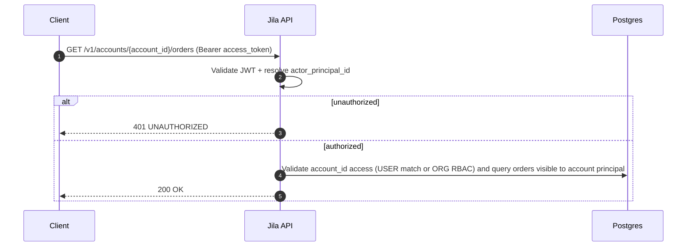

#### 0.5.14 `POST /v1/accounts`

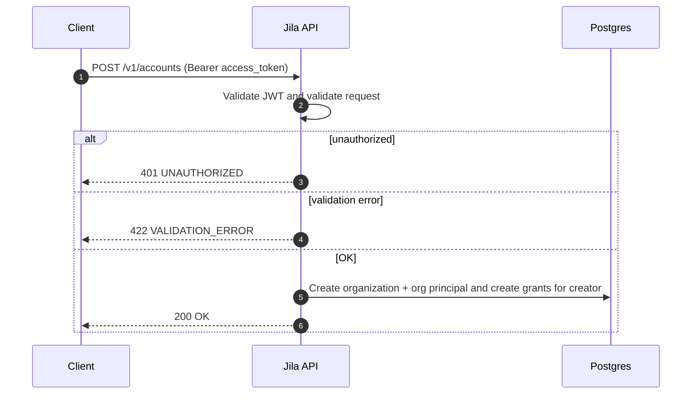

#### 0.5.15 `GET /v1/accounts/{account_id}`

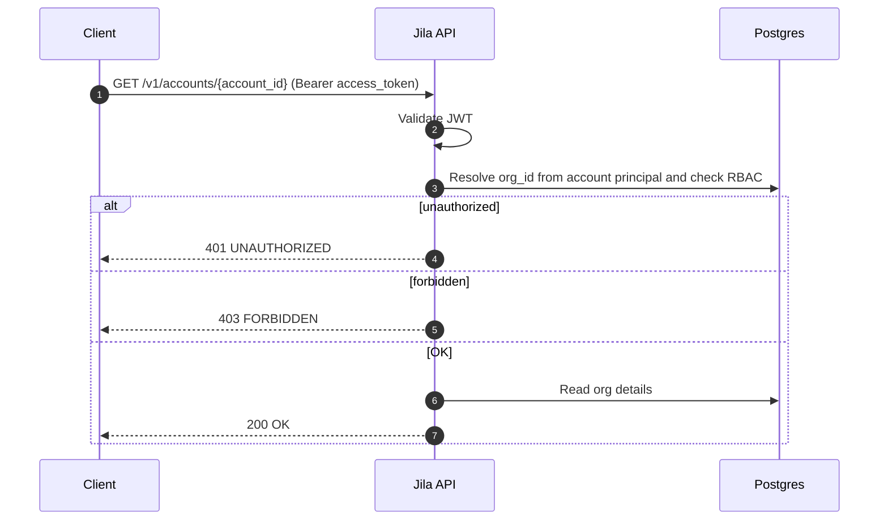

#### 0.5.16 `POST /v1/accounts/{account_id}/sites`

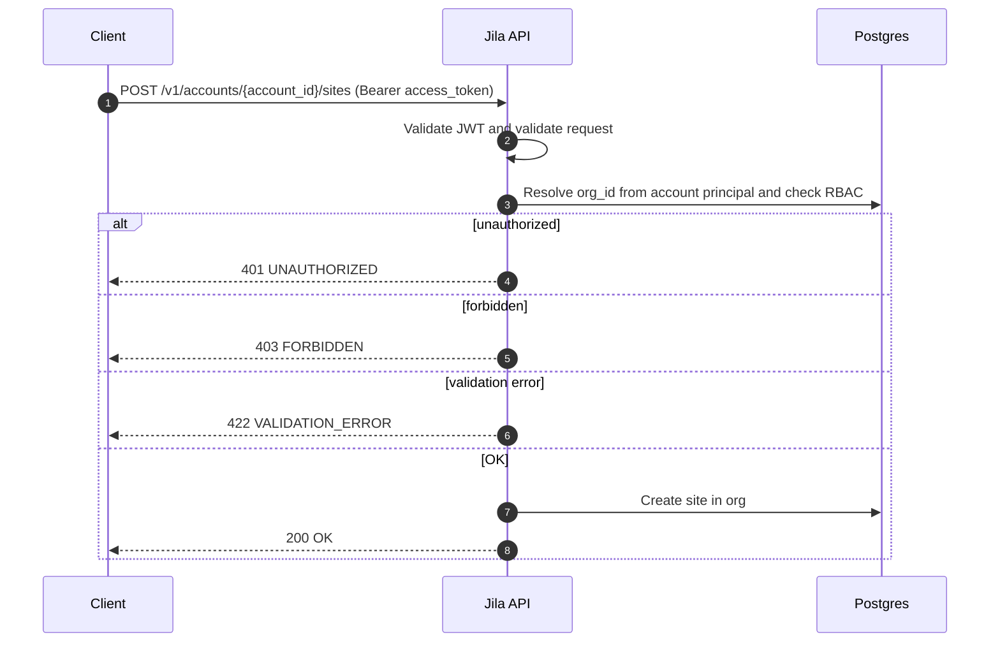

#### 0.5.17 `GET /v1/accounts/{account_id}/sites`

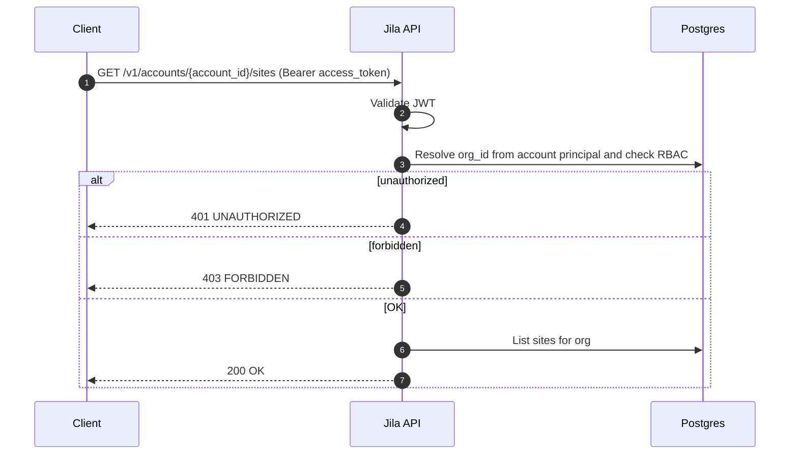

#### 0.5.17a `PATCH /v1/sites/{site_id}`

Notes:
- RBAC: requires `OWNER|MANAGER` on `ORG:<org_id>` (where the site owner principal is the org principal).
- Soft-deleted sites behave as not-found (`404`).

#### 0.5.17b `DELETE /v1/sites/{site_id}` (soft delete)

Soft delete semantics:
- Set `sites.deleted_at = now()` (UTC) and update `updated_at`.
- Deleted sites are excluded from `/v1/accounts/{account_id}/sites`.
- Idempotent: deleting an already-deleted site returns `200 OK`.
- Preserves historical rows for audit (no hard delete).
- Conflict: if the site still has active reservoirs (`reservoirs.site_id = site_id` and `reservoirs.deleted_at IS NULL`), return `409`.

#### 0.5.18 `POST /v1/accounts/{account_id}/members/invite`

```mermaid
sequenceDiagram
  autonumber
  participant C as Client
  participant API as Jila API
  participant DB as Postgres
  participant W as Worker (outbox consumers)
  participant MSG as Email delivery (AWS SES; D-012)

  C->>API: POST /v1/accounts/{account_id}/members/invite (Bearer access_token)
  API->>API: Validate JWT and validate request (target email)
  API->>DB: Resolve org_id from account principal and check RBAC to invite users into org
  alt unauthorized
    API-->>C: 401 UNAUTHORIZED
  else forbidden
    API-->>C: 403 FORBIDDEN
  else validation error
    API-->>C: 422 VALIDATION_ERROR
  else OK
    API->>DB: Create/reuse INVITE token and insert ORG_INVITE_SENT outbox event
    API-->>C: 200 OK
    Note over API,DB: Commit transaction (token + event atomically)
    W->>DB: Ingest ORG_INVITE_SENT, create org_invite_deliveries row
    W->>MSG: Send invite email
    W->>DB: Mark SENT and emit ORG_INVITE_EMAIL_SENT (or ORG_INVITE_EMAIL_FAILED)
  end
```

#### 0.5.18a `POST /v1/accounts/{account_id}/invites/{invite_token_id}/revoke`

```mermaid
sequenceDiagram
  autonumber
  participant C as Client
  participant API as Jila API
  participant DB as Postgres

  C->>API: POST /v1/accounts/{account_id}/invites/{invite_token_id}/revoke (Bearer access_token)
  API->>API: Validate JWT
  API->>DB: Resolve org_id from account principal and check RBAC (OWNER|MANAGER)
  alt unauthorized
    API-->>C: 401 UNAUTHORIZED
  else forbidden
    API-->>C: 403 FORBIDDEN
  else OK
    API->>DB: Mark invite token revoked_at (idempotent; no-op if already used/revoked)
    API-->>C: 200 {status="OK"}
  end
```

#### 0.5.19 `POST /v1/accounts/{account_id}/reservoirs`

```mermaid
sequenceDiagram
  autonumber
  participant C as Client
  participant API as Jila API
  participant DB as Postgres

  C->>API: POST /v1/accounts/{account_id}/reservoirs (Bearer access_token)
  API->>API: Validate JWT and validate request
  alt unauthorized
    API-->>C: 401 UNAUTHORIZED
  else validation error
    API-->>C: 422 VALIDATION_ERROR
  else OK
    API->>DB: Create reservoir and create access_grants for owner
    API->>DB: Insert events row RESERVOIR_CREATED
    API-->>C: 200 OK
  end
```

#### 0.5.20 `GET /v1/reservoirs/{reservoir_id}`

```mermaid
sequenceDiagram
  autonumber
  participant C as Client
  participant API as Jila API
  participant DB as Postgres

  C->>API: GET /v1/reservoirs/{reservoir_id} (Bearer access_token)
  API->>API: Validate JWT
  API->>DB: Check RBAC for reservoir_id
  alt unauthorized
    API-->>C: 401 UNAUTHORIZED
  else forbidden
    API-->>C: 403 FORBIDDEN
  else OK
    API->>DB: Read reservoir + latest view fields
    API-->>C: 200 OK
  end
```

#### 0.5.21 `PATCH /v1/reservoirs/{reservoir_id}`

```mermaid
sequenceDiagram
  autonumber
  participant C as Client
  participant API as Jila API
  participant DB as Postgres

  C->>API: PATCH /v1/reservoirs/{reservoir_id} (Bearer access_token)
  API->>API: Validate JWT and validate patch body
  API->>DB: Check RBAC for reservoir_id
  alt unauthorized
    API-->>C: 401 UNAUTHORIZED
  else forbidden
    API-->>C: 403 FORBIDDEN
  else validation error
    API-->>C: 422 VALIDATION_ERROR
  else OK
    API->>DB: Apply updates (partial)
    API->>DB: Insert events row (reservoir updated)
    API-->>C: 200 OK
  end
```

#### 0.5.21a `DELETE /v1/reservoirs/{reservoir_id}` (soft delete)

Soft delete semantics:
- Set `reservoirs.deleted_at = now()` (UTC) and update `updated_at`.
- Deleted reservoirs are excluded from list endpoints (e.g., `/v1/accounts/{account_id}/reservoirs`, seller listings).
- `GET /v1/reservoirs/{reservoir_id}` returns `404` after deletion.
- Idempotent: deleting an already-deleted reservoir returns `200 OK`.
- Preserves historical rows for audit (no hard delete).

```mermaid
sequenceDiagram
  autonumber
  participant C as Client
  participant API as Jila API
  participant DB as Postgres

  C->>API: DELETE /v1/reservoirs/{reservoir_id} (Bearer access_token)
  API->>API: Validate JWT
  API->>DB: Check RBAC for reservoir_id (including deleted)
  alt unauthorized
    API-->>C: 401 UNAUTHORIZED
  else forbidden
    API-->>C: 403 FORBIDDEN
  else active device attached
    API-->>C: 409 RESOURCE_CONFLICT
  else OK
    API->>DB: Update reservoirs.deleted_at + updated_at
    API->>DB: Insert events row RESERVOIR_DELETED
    API-->>C: 200 OK
  end
```

#### 0.5.22 `GET /v1/reservoirs/{reservoir_id}/readings`

```mermaid
sequenceDiagram
  autonumber
  participant C as Client
  participant API as Jila API
  participant DB as Postgres

  C->>API: GET /v1/reservoirs/{reservoir_id}/readings (Bearer access_token)
  API->>API: Validate JWT and validate pagination and cursor
  API->>DB: Check RBAC for reservoir_id
  alt unauthorized
    API-->>C: 401 UNAUTHORIZED
  else forbidden
    API-->>C: 403 FORBIDDEN
  else validation error
    API-->>C: 422 VALIDATION_ERROR
  else OK
    API->>DB: Query reservoir_readings (history window + pagination)
    API-->>C: 200 OK
  end
```

#### 0.5.23 `POST /v1/reservoirs/{reservoir_id}/manual-reading`

```mermaid
sequenceDiagram
  autonumber
  participant C as Client
  participant API as Jila API
  participant DB as Postgres

  C->>API: POST /v1/reservoirs/{reservoir_id}/manual-reading (Bearer access_token)
  API->>API: Validate JWT and validate reading body
  API->>DB: Check RBAC for reservoir_id
  alt unauthorized
    API-->>C: 401 UNAUTHORIZED
  else forbidden
    API-->>C: 403 FORBIDDEN
  else validation error
    API-->>C: 422 VALIDATION_ERROR
  else OK
    API->>DB: Insert reservoir_readings (source=MANUAL, recorded_at=request.recorded_at normalized to UTC)
    API->>DB: Insert events row RESERVOIR_LEVEL_READING
    API-->>C: 200 OK
  end
```

#### 0.5.24 `PATCH /v1/reservoirs/{reservoir_id}`

```mermaid
sequenceDiagram
  autonumber
  participant C as Client
  participant API as Jila API
  participant DB as Postgres

  C->>API: PATCH /v1/reservoirs/{reservoir_id} (Bearer access_token)
  API->>API: Validate JWT and validate lat and lng (D-006 cap rules)
  API->>DB: Check RBAC for reservoir_id
  alt unauthorized
    API-->>C: 401 UNAUTHORIZED
  else forbidden
    API-->>C: 403 FORBIDDEN
  else validation error
    API-->>C: 422 VALIDATION_ERROR
  else OK
    API->>DB: Update reservoirs.location (geography) + location_updated_at (UTC)
    API->>DB: Insert events row RESERVOIR_LOCATION_UPDATED
    API-->>C: 200 OK
  end
```

#### 0.5.24a `POST /v1/reservoirs/{reservoir_id}/share`

```mermaid
sequenceDiagram
  autonumber
  participant C as Client
  participant API as Jila API
  participant DB as Postgres

  C->>API: POST /v1/reservoirs/{reservoir_id}/share (Bearer access_token)
  API->>API: Validate JWT
  API->>DB: Check RBAC (manage access) for reservoir_id
  alt unauthorized
    API-->>C: 401 UNAUTHORIZED
  else forbidden
    API-->>C: 403 FORBIDDEN
  else validation error
    API-->>C: 422 VALIDATION_ERROR
  else OK
    API->>DB: Create or reuse INVITE token for RESERVOIR:<reservoir_id>
    API->>DB: Insert events row RESERVOIR_SHARE_INVITED
    API-->>C: 200 OK
  end
```

#### 0.5.24b `POST /v1/reservoir-invites/accept`

```mermaid
sequenceDiagram
  autonumber
  participant C as Client
  participant API as Jila API
  participant DB as Postgres

  C->>API: POST /v1/reservoir-invites/accept (Bearer access_token)
  API->>API: Validate JWT and validate invite_token_id
  API->>DB: Load INVITE token and validate (type/object/expiry/unused)
  alt unauthorized
    API-->>C: 401 UNAUTHORIZED
  else expired
    API-->>C: 409 INVITE_EXPIRED
  else invalid
    API-->>C: 422 INVALID_INVITE
  else OK
    API->>DB: Mark token used
    API->>DB: Ensure access_grants for RESERVOIR:<reservoir_id> for caller
    API->>DB: Insert events row RESERVOIR_SHARE_ACCEPTED
    API->>DB: Insert events row FIRESTORE_MIRROR_RECONCILE_REQUESTED
    API-->>C: 200 OK
  end
```

#### 0.5.25 `POST /v1/internal/devices/{device_id}/register`

```mermaid
sequenceDiagram
  autonumber
  participant C as Client
  participant API as Jila API
  participant DB as Postgres

  C->>API: POST /v1/internal/devices/{device_id}/register (Bearer access_token)
  API->>API: Validate JWT and validate provisioning permissions (internal ops admin; D-059)
  API->>API: Validate that account_id matches authenticated admin principal
  alt unauthorized
    API-->>C: 401 UNAUTHORIZED
  else forbidden (not a provisioner)
    API-->>C: 403 FORBIDDEN
  else validation error
    API-->>C: 422 VALIDATION_ERROR
  else OK
    API->>DB: Create or update devices row (device_id) only if matching inventory unit exists
    API->>DB: Insert events row DEVICE_REGISTERED
    API-->>C: 200 OK
  end
```

#### 0.5.26 `POST /v1/accounts/{account_id}/devices/attach`

```mermaid
sequenceDiagram
  autonumber
  participant C as Client
  participant API as Jila API
  participant DB as Postgres

  C->>API: POST /v1/accounts/{account_id}/devices/attach (Bearer access_token)
  API->>API: Validate JWT and validate attach body
  API->>DB: Check RBAC for reservoir_id
  alt unauthorized
    API-->>C: 401 UNAUTHORIZED
  else forbidden
    API-->>C: 403 FORBIDDEN
  else attach fails (non-revealing)
    API-->>C: 409 RESOURCE_CONFLICT (generic; does not reveal serial existence/ownership)
  else 1:1 pairing conflict
    API-->>C: 409 DEVICE_ALREADY_PAIRED
  else OK
    API->>DB: Attach device to reservoir (v1 1:1; resolve by serial_number)
    API->>DB: Insert events row DEVICE_ATTACHED
    API-->>C: 200 OK { status, device_id }
  end
```

#### 0.5.27 `POST /v1/accounts/{account_id}/devices/{device_id}/detach`

```mermaid
sequenceDiagram
  autonumber
  participant C as Client
  participant API as Jila API
  participant DB as Postgres

  C->>API: POST /v1/accounts/{account_id}/devices/{device_id}/detach (Bearer access_token)
  API->>API: Validate JWT
  API->>DB: Check RBAC for device_id
  alt unauthorized
    API-->>C: 401 UNAUTHORIZED
  else forbidden
    API-->>C: 403 FORBIDDEN
  else OK
    API->>DB: Detach device from reservoir
    API->>DB: Insert events row DEVICE_DETACHED
    API-->>C: 200 OK
  end
```

#### 0.5.27a `GET /v1/internal/devices/{device_id}/overview`

```mermaid
sequenceDiagram
  autonumber
  participant C as Client (Admin Portal)
  participant API as Jila API
  participant DB as Postgres

  C->>API: GET /v1/internal/devices/{device_id}/overview (Bearer access_token)
  API->>API: Validate JWT and internal-ops-admin gating
  alt unauthorized
    API-->>C: 401 UNAUTHORIZED
  else forbidden
    API-->>C: 403 FORBIDDEN
  else not found
    API-->>C: 404 RESOURCE_NOT_FOUND
  else OK
    API->>DB: Load inventory unit (device_inventory_units by device_id)
    API->>DB: Load operational device + attachment context
    API->>DB: Summarize telemetry window (device_telemetry_messages)
    API->>DB: Load config desired/applied snapshots
    API->>DB: Load latest firmware job (if any)
    API->>DB: Optionally load recent events (subject=DEVICE)
    API-->>C: 200 OK
  end
```

#### 0.5.28 `GET /v1/accounts/{account_id}/devices/{device_id}/config`

```mermaid
sequenceDiagram
  autonumber
  participant C as Client
  participant API as Jila API
  participant DB as Postgres

  C->>API: GET /v1/accounts/{account_id}/devices/{device_id}/config (Bearer access_token)
  API->>API: Validate JWT
  API->>DB: Check RBAC for device_id
  alt unauthorized
    API-->>C: 401 UNAUTHORIZED
  else forbidden
    API-->>C: 403 FORBIDDEN
  else OK
    API->>DB: Read current desired device config snapshot
    API-->>C: 200 OK
  end
```

#### 0.5.28a Internal ops bypass note (v1)

Internal ops admins call `GET /v1/accounts/{account_id}/devices/{device_id}/config` and the backend applies internal ops bypass rules
(D-059).

#### 0.5.29 `PUT /v1/accounts/{account_id}/devices/{device_id}/config`

```mermaid
sequenceDiagram
  autonumber
  participant C as Client
  participant API as Jila API
  participant DB as Postgres

  C->>API: PUT /v1/accounts/{account_id}/devices/{device_id}/config (Bearer access_token)
  API->>API: Validate JWT and validate config payload
  API->>DB: Check RBAC for device_id
  alt unauthorized
    API-->>C: 401 UNAUTHORIZED
  else forbidden
    API-->>C: 403 FORBIDDEN
  else validation error
    API-->>C: 422 VALIDATION_ERROR
  else OK
    API->>DB: Persist desired config and bump config version and nonce
    API->>DB: Insert events row DEVICE_CONFIG_UPDATED
    API-->>C: 200 OK
  end
```

#### 0.5.29a Internal ops bypass note (v1)

Internal ops admins call `PUT /v1/accounts/{account_id}/devices/{device_id}/config` and the backend applies internal ops bypass rules
(D-059).

#### 0.5.30 `POST /v1/internal/firmware/releases`

```mermaid
sequenceDiagram
  autonumber
  participant C as Client
  participant API as Jila API
  participant DB as Postgres

  C->>API: POST /v1/internal/firmware/releases (Bearer access_token)
  API->>API: Validate JWT and internal-ops-admin gating and validate firmware metadata
  alt unauthorized
    API-->>C: 401 UNAUTHORIZED
  else forbidden
    API-->>C: 403 FORBIDDEN
  else validation error
    API-->>C: 422 VALIDATION_ERROR
  else OK
    API->>DB: Create firmware release record
    API->>DB: Insert events row FIRMWARE_RELEASE_CREATED
    API-->>C: 200 OK
  end
```

#### 0.5.31 `GET /v1/firmware/releases`

```mermaid
sequenceDiagram
  autonumber
  participant C as Client
  participant API as Jila API
  participant DB as Postgres

  C->>API: GET /v1/firmware/releases (Bearer access_token)
  API->>API: Validate JWT
  API->>DB: Check permission to view firmware releases
  alt unauthorized
    API-->>C: 401 UNAUTHORIZED
  else forbidden
    API-->>C: 403 FORBIDDEN
  else OK
    API->>DB: List firmware releases (pagination if applicable)
    API-->>C: 200 OK
  end
```

#### 0.5.32 `POST /v1/accounts/{account_id}/devices/{device_id}/firmware-update`

```mermaid
sequenceDiagram
  autonumber
  participant C as Client
  participant API as Jila API
  participant DB as Postgres

  C->>API: POST /v1/accounts/{account_id}/devices/{device_id}/firmware-update (Bearer access_token)
  API->>API: Validate JWT and validate target firmware version
  API->>DB: Check RBAC for device_id
  alt unauthorized
    API-->>C: 401 UNAUTHORIZED
  else forbidden
    API-->>C: 403 FORBIDDEN
  else validation error
    API-->>C: 422 VALIDATION_ERROR
  else OK
    API->>DB: Persist desired firmware update request
    API->>DB: Insert events row FIRMWARE_UPDATE_REQUESTED
    API-->>C: 200 OK
  end
```

#### 0.5.32a Internal ops bypass note (v1)

Internal ops admins call `POST /v1/accounts/{account_id}/devices/{device_id}/firmware-update` and the backend applies internal ops bypass
rules (D-059).

#### 0.5.33 `GET /v1/supply-points` (public discovery)

```mermaid
sequenceDiagram
  autonumber
  participant C as Client
  participant API as Jila API
  participant DB as Postgres

  C->>API: GET /v1/supply-points (public)
  API->>API: Validate query params (lat/lng/radius cap per D-006)
  alt validation error
    API-->>C: 422 VALIDATION_ERROR
  else OK
    API->>DB: Query supply_points with geo filter + status filters
    API-->>C: 200 OK
  end
```

#### 0.5.34 `POST /v1/accounts/{account_id}/seller-profile`

```mermaid
sequenceDiagram
  autonumber
  participant C as Client
  participant API as Jila API
  participant DB as Postgres

  C->>API: POST /v1/accounts/{account_id}/seller-profile (Bearer access_token)
  API->>API: Validate JWT and validate request
  alt unauthorized
    API-->>C: 401 UNAUTHORIZED
  else validation error
    API-->>C: 422 VALIDATION_ERROR
  else OK
    API->>DB: Create seller_profile for principal
    API->>DB: Insert events row SELLER_PROFILE_CREATED
    API-->>C: 200 OK
  end
```

#### 0.5.35 `PATCH /v1/accounts/{account_id}/seller-profile`

```mermaid
sequenceDiagram
  autonumber
  participant C as Client
  participant API as Jila API
  participant DB as Postgres

  C->>API: PATCH /v1/accounts/{account_id}/seller-profile (Bearer access_token)
  API->>API: Validate JWT and validate patch body
  alt unauthorized
    API-->>C: 401 UNAUTHORIZED
  else no seller profile
    API-->>C: 404 NOT_FOUND
  else validation error
    API-->>C: 422 VALIDATION_ERROR
  else OK
    API->>DB: Update seller_profile fields
    API->>DB: Insert events row SELLER_PROFILE_UPDATED
    API-->>C: 200 OK
  end
```

#### 0.5.36 `GET /v1/accounts/{account_id}/seller/reservoirs`

```mermaid
sequenceDiagram
  autonumber
  participant C as Client
  participant API as Jila API
  participant DB as Postgres

  C->>API: GET /v1/accounts/{account_id}/seller/reservoirs (Bearer access_token)
  API->>API: Validate JWT
  API->>DB: Check seller profile is ACTIVE
  alt unauthorized
    API-->>C: 401 UNAUTHORIZED
  else seller profile not ACTIVE
    API-->>C: 403 FORBIDDEN
  else OK
    API->>DB: List seller reservoirs visible to principal
    API-->>C: 200 OK
  end
```

#### 0.5.37 `PATCH /v1/accounts/{account_id}/seller/reservoirs/{reservoir_id}`

```mermaid
sequenceDiagram
  autonumber
  participant C as Client
  participant API as Jila API
  participant DB as Postgres

  C->>API: PATCH /v1/accounts/{account_id}/seller/reservoirs/{reservoir_id} (Bearer access_token)
  API->>API: Validate JWT and validate patch body
  API->>DB: Check seller profile ACTIVE + RBAC for reservoir_id
  alt unauthorized
    API-->>C: 401 UNAUTHORIZED
  else seller profile not ACTIVE
    API-->>C: 403 FORBIDDEN
  else forbidden
    API-->>C: 403 FORBIDDEN
  else validation error
    API-->>C: 422 VALIDATION_ERROR
  else OK
    API->>DB: Update seller-specific reservoir listing fields
    API->>DB: Insert events row SELLER_RESERVOIR_UPDATED
    API-->>C: 200 OK
  end
```

#### 0.5.38 `POST /v1/accounts/{account_id}/seller/reservoirs/{reservoir_id}/price-rules`

```mermaid
sequenceDiagram
  autonumber
  participant C as Client
  participant API as Jila API
  participant DB as Postgres

  C->>API: POST /v1/accounts/{account_id}/seller/reservoirs/{reservoir_id}/price-rules (Bearer access_token)
  API->>API: Validate JWT and validate price rule body
  API->>DB: Check seller profile ACTIVE + RBAC for reservoir_id
  alt unauthorized
    API-->>C: 401 UNAUTHORIZED
  else seller profile not ACTIVE
    API-->>C: 403 FORBIDDEN
  else forbidden
    API-->>C: 403 FORBIDDEN
  else validation error
    API-->>C: 422 VALIDATION_ERROR
  else price rule overlap conflict
    API-->>C: 409 PRICE_RULE_OVERLAP
  else OK
    API->>DB: Insert price rule
    API->>DB: Insert events row PRICE_RULE_CREATED
    API-->>C: 200 OK
  end
```

#### 0.5.39 `GET /v1/marketplace/reservoir-listings` (public discovery)

```mermaid
sequenceDiagram
  autonumber
  participant C as Client
  participant API as Jila API
  participant DB as Postgres

  C->>API: GET /v1/marketplace/reservoir-listings (public)
  API->>API: Validate query params (geo cap per D-006)
  alt validation error
    API-->>C: 422 VALIDATION_ERROR
  else OK
    API->>DB: Query eligible listings only
    API-->>C: 200 OK
  end
```

#### 0.5.40 `POST /v1/accounts/{account_id}/orders`

```mermaid
sequenceDiagram
  autonumber
  participant C as Client
  participant API as Jila API
  participant DB as Postgres

  C->>API: POST /v1/accounts/{account_id}/orders (Bearer access_token)
  API->>API: Validate JWT and validate order body
  alt unauthorized
    API-->>C: 401 UNAUTHORIZED
  else validation error
    API-->>C: 422 VALIDATION_ERROR
  else listing not eligible / not found
    API-->>C: 409 INVALID_ORDER_STATE
  else OK
    API->>DB: Create order (status=CREATED)
    API->>DB: Insert events row ORDER_CREATED
    API-->>C: 200 OK
  end
```

#### 0.5.41 `GET /v1/accounts/{account_id}/orders/{order_id}`

```mermaid
sequenceDiagram
  autonumber
  participant C as Client
  participant API as Jila API
  participant DB as Postgres

  C->>API: GET /v1/accounts/{account_id}/orders/{order_id} (Bearer access_token)
  API->>API: Validate JWT
  API->>DB: Check RBAC for order_id (buyer/seller)
  alt unauthorized
    API-->>C: 401 UNAUTHORIZED
  else forbidden
    API-->>C: 403 FORBIDDEN
  else OK
    API->>DB: Read order details
    API-->>C: 200 OK
  end
```

#### 0.5.42 `POST /v1/accounts/{account_id}/orders/{order_id}/accept`

```mermaid
sequenceDiagram
  autonumber
  participant C as Client
  participant API as Jila API
  participant DB as Postgres

  C->>API: POST /v1/accounts/{account_id}/orders/{order_id}/accept (Bearer access_token)
  API->>API: Validate JWT
  API->>DB: Check RBAC (seller) + current order status
  alt unauthorized
    API-->>C: 401 UNAUTHORIZED
  else forbidden
    API-->>C: 403 FORBIDDEN
  else invalid state transition
    API-->>C: 409 INVALID_ORDER_STATE
  else OK
    API->>DB: Update status=ACCEPTED
    API->>DB: Insert events row ORDER_ACCEPTED
    API-->>C: 200 OK
  end
```

#### 0.5.43 `POST /v1/accounts/{account_id}/orders/{order_id}/reject`

```mermaid
sequenceDiagram
  autonumber
  participant C as Client
  participant API as Jila API
  participant DB as Postgres

  C->>API: POST /v1/accounts/{account_id}/orders/{order_id}/reject (Bearer access_token)
  API->>API: Validate JWT
  API->>DB: Check RBAC (seller) + current order status
  alt unauthorized
    API-->>C: 401 UNAUTHORIZED
  else forbidden
    API-->>C: 403 FORBIDDEN
  else invalid state transition
    API-->>C: 409 INVALID_ORDER_STATE
  else OK
    API->>DB: Update status=REJECTED
    API->>DB: Insert events row ORDER_REJECTED
    API-->>C: 200 OK
  end
```

#### 0.5.44 `POST /v1/accounts/{account_id}/orders/{order_id}/cancel`

```mermaid
sequenceDiagram
  autonumber
  participant C as Client
  participant API as Jila API
  participant DB as Postgres

  C->>API: POST /v1/accounts/{account_id}/orders/{order_id}/cancel (Bearer access_token)
  API->>API: Validate JWT
  API->>DB: Check RBAC (buyer or seller) + current order status
  alt unauthorized
    API-->>C: 401 UNAUTHORIZED
  else forbidden
    API-->>C: 403 FORBIDDEN
  else invalid state transition
    API-->>C: 409 INVALID_ORDER_STATE
  else OK
    API->>DB: Update status=CANCELLED
    API->>DB: Insert events row ORDER_CANCELLED
    API-->>C: 200 OK
  end
```

#### 0.5.45 `POST /v1/accounts/{account_id}/orders/{order_id}/confirm-delivery`

```mermaid
sequenceDiagram
  autonumber
  participant C as Client
  participant API as Jila API
  participant DB as Postgres

  C->>API: POST /v1/accounts/{account_id}/orders/{order_id}/confirm-delivery (Bearer access_token)
  API->>API: Validate JWT and validate confirmation body
  API->>DB: Check RBAC (buyer or seller) + current order status
  alt unauthorized
    API-->>C: 401 UNAUTHORIZED
  else forbidden
    API-->>C: 403 FORBIDDEN
  else invalid state transition
    API-->>C: 409 INVALID_ORDER_STATE
  else OK
    API->>DB: Record confirmation (server UTC timestamp)
    API->>DB: If both confirmations present, set status=DELIVERED
    API->>DB: Insert events row ORDER_DELIVERED (when delivered)
    API-->>C: 200 OK
  end
```

#### 0.5.46 `POST /v1/accounts/{account_id}/orders/{order_id}/dispute`

```mermaid
sequenceDiagram
  autonumber
  participant C as Client
  participant API as Jila API
  participant DB as Postgres

  C->>API: POST /v1/accounts/{account_id}/orders/{order_id}/dispute (Bearer access_token)
  API->>API: Validate JWT and validate dispute body
  API->>DB: Check RBAC (buyer or seller) + current order status
  alt unauthorized
    API-->>C: 401 UNAUTHORIZED
  else forbidden
    API-->>C: 403 FORBIDDEN
  else invalid state transition
    API-->>C: 409 INVALID_ORDER_STATE
  else OK
    API->>DB: Record dispute and set status=DISPUTED
    API->>DB: Insert events row ORDER_DISPUTED
    API-->>C: 200 OK
  end
```

#### 0.5.47 `POST /v1/accounts/{account_id}/orders/{order_id}/reviews`

```mermaid
sequenceDiagram
  autonumber
  participant C as Client
  participant API as Jila API
  participant DB as Postgres

  C->>API: POST /v1/accounts/{account_id}/orders/{order_id}/reviews (Bearer access_token)
  API->>API: Validate JWT and validate review body
  API->>DB: Check RBAC + order delivered
  alt unauthorized
    API-->>C: 401 UNAUTHORIZED
  else forbidden
    API-->>C: 403 FORBIDDEN
  else order not in delivered state
    API-->>C: 409 INVALID_ORDER_STATE
  else OK
    API->>DB: Create review
    API->>DB: Insert events row REVIEW_SUBMITTED
    API-->>C: 200 OK
  end
```

#### 0.5.48 `GET /v1/accounts/{account_id}/subscription`

```mermaid
sequenceDiagram
  autonumber
  participant C as Client
  participant API as Jila API
  participant DB as Postgres

  C->>API: GET /v1/accounts/{account_id}/subscription (Bearer access_token)
  API->>API: Validate JWT and resolve principal_id
  alt unauthorized
    API-->>C: 401 UNAUTHORIZED
  else OK
    API->>DB: Read current subscription for principal
    API-->>C: 200 OK
  end
```

#### 0.5.49 `PATCH /v1/accounts/{account_id}/subscription`

```mermaid
sequenceDiagram
  autonumber
  participant C as Client
  participant API as Jila API
  participant DB as Postgres

  C->>API: PATCH /v1/accounts/{account_id}/subscription (Bearer access_token)
  API->>API: Validate JWT and validate plan selection
  alt unauthorized
    API-->>C: 401 UNAUTHORIZED
  else validation error
    API-->>C: 422 VALIDATION_ERROR
  else OK
    API->>DB: Update subscription plan and status
    API->>DB: Insert events row SUBSCRIPTION_UPGRADED
    API-->>C: 200 OK
  end
```

#### 0.5.51 `GET /v1/accounts/{account_id}/alerts`

```mermaid
sequenceDiagram
  autonumber
  participant C as Client
  participant API as Jila API
  participant DB as Postgres

  C->>API: GET /v1/accounts/{account_id}/alerts (Bearer access_token)
  API->>API: Validate JWT and validate cursor and pagination
  alt unauthorized
    API-->>C: 401 UNAUTHORIZED
  else validation error
    API-->>C: 422 VALIDATION_ERROR
  else OK
    API->>DB: Query alerts visible to principal
    API-->>C: 200 OK
  end
```

#### 0.5.52 `POST /v1/accounts/{account_id}/alerts/{alert_id}/mark-read`

```mermaid
sequenceDiagram
  autonumber
  participant C as Client
  participant API as Jila API
  participant DB as Postgres

  C->>API: POST /v1/accounts/{account_id}/alerts/{alert_id}/mark-read (Bearer access_token)
  API->>API: Validate JWT
  API->>DB: Check RBAC for alert_id
  alt unauthorized
    API-->>C: 401 UNAUTHORIZED
  else forbidden
    API-->>C: 403 FORBIDDEN
  else OK
    API->>DB: Set read_at (server UTC)
    API-->>C: 200 OK
  end
```

#### 0.5.53 `GET /v1/accounts/{account_id}/events`

```mermaid
sequenceDiagram
  autonumber
  participant C as Client
  participant API as Jila API
  participant DB as Postgres

  C->>API: GET /v1/accounts/{account_id}/events (Bearer access_token)
  API->>API: Validate JWT + org RBAC + cursor/pagination
  alt unauthorized
    API-->>C: 401 UNAUTHORIZED
  else forbidden
    API-->>C: 403 FORBIDDEN
  else validation error
    API-->>C: 422 VALIDATION_ERROR
  else OK
    API->>DB: Query events scoped to account-owned ORG/SITE/RESERVOIR/DEVICE subjects
    API-->>C: 200 OK
  end
```

#### 0.5.54 `GET /v1/accounts/{account_id}/events/{event_id}`

```mermaid
sequenceDiagram
  autonumber
  participant C as Client
  participant API as Jila API
  participant DB as Postgres

  C->>API: GET /v1/accounts/{account_id}/events/{event_id} (Bearer access_token)
  API->>API: Validate JWT + org RBAC + event_id
  alt unauthorized
    API-->>C: 401 UNAUTHORIZED
  else forbidden
    API-->>C: 403 FORBIDDEN
  else validation error
    API-->>C: 422 VALIDATION_ERROR
  else not found or out of scope
    API-->>C: 404 RESOURCE_NOT_FOUND
  else OK
    API->>DB: Load scoped event row and optional linked telemetry row
    API-->>C: 200 OK
  end
```

---
